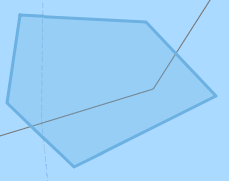
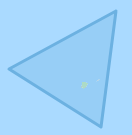
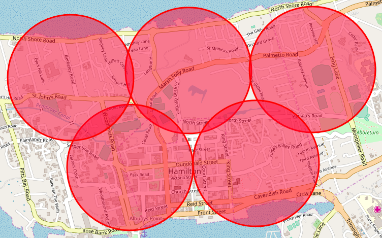

#########
Instances
#########
.. include:: ../../formatting.rst
.. contents::
   :local:
   
| Instances control the devices. Each Instance has a specific scheduler type. Instances can have multiple devices asigned to it.

Create a new Instance
---------------------

- Open RDM in the Webbrowser and login as admin
- Go to Dashboard -> Instances and click "Add New Instance" 
- Scheduler Types: 

  - ``Circle Pokemon`` Scans for Pokemon (Nearby) at exactly the coords specified

    - Name: A unique name of the Instance
    - Timezone offset: Not used
    - Min Level: Minimum worker level
    - Max Level: Maximum worker level
    - Scan Area: List of Lat,Lon that the worker will teleport to to scan for Pokemon.
    - Notes: The worker will stay at each location for approximately 20 seconds and then move on to the next lat,lon

  - ``Circle Raid`` Scans for Raids at exactly the coords specified

    - Name: A unique name of the Instance
    - Timezone offset: Not used
    - Min Level: Minimum worker level
    - Max Level: Maximum worker level
    - Scan Area: List of Lat,Lon that the worker will teleport to to scan for Raids.
    - Notes: The worker will stay at each location for approximately 10 seconda and then move on to the next lat,lon

  - ``Auto Quest`` Scans all pokestops in the geofence for quests

    - Name: A unique name of the Instance
    - Timezone offset: Your timezone offset from GMT in seconds. (ie. if you are GMT-8 do -8*3600=-28800). This is used to auto clear your database quests at midnight local time.
    - Min Level: Minimum worker level
    - Max Level: Maximum worker level
    - Scan Area: This scheduler type requires your database to be populated with pokestops already and then uses geofences to pull the pokestops. Geofences should be populated like
    - Notes: You can use multiple geofences for this instance.

  - ``Pokemon IV`` Scans pokemon for IV's

    - Name: A unique name of the Instance
    - Timezone offset: Not used
    - Min Level: Minimum worker level (You probably want this set to 30)
    - Max Level: Maximum worker level (You probably want this set to 40)
    - Scan Area: This instance uses geofences like above.
    - Pokemon IDs: List from highest priority to lowest of the pokemon you want to scan for IVs.
    - Notes: Put the highest priority IDs at the beginning, things like Tyranitar, Dragonite, etc. but also put other IDs after so the IV workers are always working. If a high priority pokemon spawns it will jump to the top of the list.

- Save the Instance
- Start the Device Controler for that device one
- Go to Dashboard -> Devices and click "Asign Instance" for that new device
- Select the instance and click "Assign"
- Your device should now start scanning

Mapping Tools
--------------
- `RDM Tools <https://github.com/abakedapplepie/RealDeviceMap-tools>`_
- `https://jennerpalacios.github.io/PoGoMappingTool/ <https://jennerpalacios.github.io/PoGoMappingTool/>`_
- `https://www.mapdevelopers.com/draw-circle-tool.php <https://www.mapdevelopers.com/draw-circle-tool.php>`_
- `https://thermoscookies.github.io/rdmsort/ <https://thermoscookies.github.io/rdmsort/>`_

Scan Area Examples
------------------

Geofence Example: (for Auto Quest and Pokemon IV) ::

   [Geofence 1]
   48.3515038749951,-123.4311030273437
   48.2711288926114,-123.4489558105469
   48.2125948327425,-123.3569453125
   48.2775269919901,-123.1619379882812
   48.3451150449351,-123.258068359375
   [Geofence 2]
   48.3861721206049,-122.7980158691406
   48.2802687893262,-122.818615234375
   48.333247949859,-122.9449580078125

   
   Geofence 1
   

   Geofence 2

Circle List Example: (for Circle Pokemon and Circle Raids) ::

   32.30280417394316,-64.78238582611085
   32.30287672107444,-64.77191448211671
   32.2958756553048,-64.78732109069826
   32.296165865665564,-64.77667808532716
   32.30229634239795,-64.79234218597414

   Circle List
